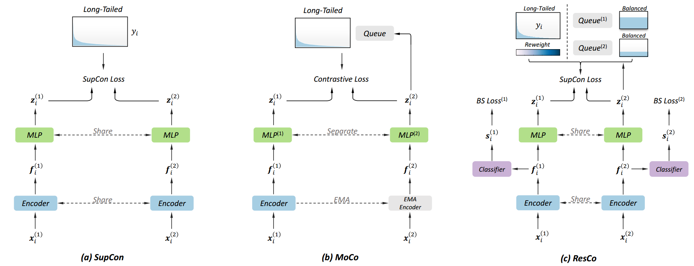

# ResCo
**Rebalanced Siamese Contrastive Learning for Long-Tailed Recognition**

<div align="center">
  
</div><br/>

**Introduction**: This repository provides an implementation for the paper: "Rebalanced Siamese Contrastive Learning for Long-Tailed Recognition" based on [MoCo](https://github.com/facebookresearch/moco), [Balanced Softmax](https://github.com/jiawei-ren/BalancedMetaSoftmax-Classification), [MiSLAS](https://github.com/dvlab-research/MiSLAS), and [PaCo](https://github.com/dvlab-research/Parametric-Contrastive-Learning). *Our study shows, imbalanced supervised contrastive learning suffers a dual class-imbalance problem at both the original batch and Siamese batch levels, which is more serious (square relationship) than long-tailed classification learning*. ResCo is an effective one-stage contrastive framework, which greatly improves recognition accuracy for long-tailed recognition.

## Installation 

**Requirements**
* Python 3.8
* torchvision 0.9.0
* Pytorch 1.8.0
* yacs 0.1.8

**Dataset Preparation**
* [CIFAR-10 & CIFAR-100](https://www.cs.toronto.edu/~kriz/cifar.html)
* [ImageNet](http://image-net.org/index)
* [iNaturalist 2018](https://github.com/visipedia/inat_comp/tree/master/2018)
* [Places](http://places2.csail.mit.edu/download.html)


## Training

To train a ResCo model for ResNet-50 on ImageNet-LT (8 GPUs), run:

```
python main_resco.py --cfg cfg/imagenet.yaml \
  lr 0.06 batch_size 256 \
  arch 'resnet50' \
  temperature 0.2 \
  effective_num_beta  0.99 \
  neg_size_per_cls 1 pos_size_per_cls 4 \
  con_weight 0.5 \
  mark train_ResCo_IN1KLT_R50
```


The saved folder (including logs and checkpoints) is organized as follows.
```
ResCo
├── saved
│   ├── mark_name
│   │   ├── ckps
│   │   │   ├── current.pth.tar
│   │   │   └── model_best.pth.tar 
│   │   └── logs
│   │       └── mark_name.txt
│   ...   
```

## Evaluation

To evaluate a ResCo model for ResNet-50 on ImageNet-LT, run:

```
python main_resco.py --cfg cfg/imagenet.yaml \
  arch 'resnet50' \
  resume /path/to/checkpoint \
  evaluate True \
  mark eval_ResCo_IN1KLT_R50
```


## Results

**1) ImageNet-LT**

| Arch.         |  Many  |  Med.  |  Few  |  All  | Top-5   | Weights |   Logs  |
| -----------   | ------ |------- |------ |------ | ------- | ------- | ------- |
| ResNet-50     | 68.0%  | 56.7%  | 37.8% | 58.3% |  81.6%  |  Link   |  Link   |


## TODO

The experiment settings for other datasets, different network architectures, model weights, detailed instructions, and training logs will be available soon.